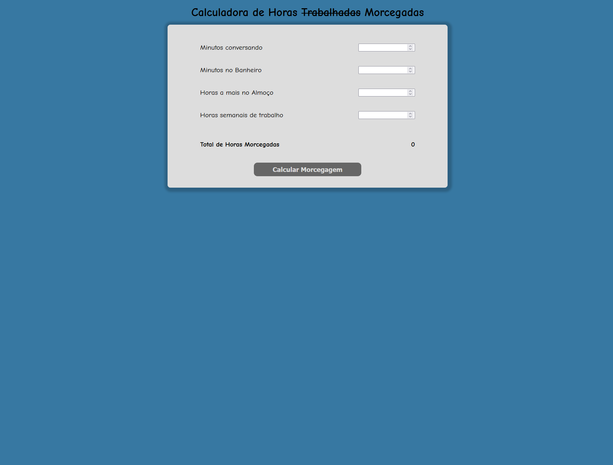

# Calculadora de horas morcegadas -  (BatCalculadora)

Ao fim desta tarefa a sua BatCalculadora deverá estar semelhante ao exemplo a seguir

## Instruções

Para chegar no resultado a cima serão necessárias algumas alterações no seu arquivo html assim como a criação de um arquivo de folha de estilo css.

- Crie um arquivo css no mesmo diretório do seu aquivo html.

- Vincule o arquivo css ao html utilizando a tag [link](https://www.w3schools.com/tags/tag_link.asp).

- Aplique as seguintes estilizações:

    - Devemos aplicar a fonte [Comic-neue](https://fonts.google.com/specimen/Comic+Neue) em todo o site para isso devemos utilizar a tag `link` novamente;
    
    - Devemos utlizar as seguintes cores (use-as livremente);

        - #3778a2;

        - #dddddd;

        - #666666;
     
    - O formulário e o título `h1` deverão ficar alinhado ao meio da página horizontalmente;

        - para isso se necessário pode-se adicionar algumas `div` para agrupar os componente;
    
    - Os `label`s e `input`s devem ficar alinhados;

    - as bordas do formulário e do botão de calcular devem ser arredondadas;

    - O formulário deve possuir uma sombra (estilize-a como quiser);

    - O botão de calcular deve ser alinhado ao centro do formulário;

    - O botão de calcular deve ter um `font-size` maior que os demais itens do formulário;

    - O cursor do mouse deve mudar para um pointer (mãozinha apontando) quando passar sobre o botão de calcular;

    - O botão de calcular deve aumentar levemente de tamanho quando o cursor estiver sobre ele, isso pode ser feito utilizando transition e transform

    

